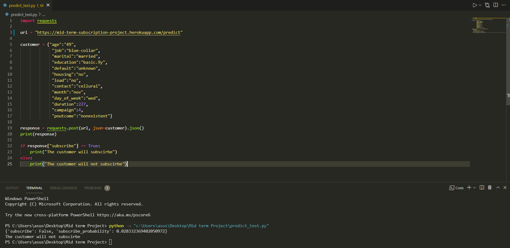

# DataTalks Zoomcamp Midterm Project: Banking dataset classification
## About Dataset
The following dataset was used for this project: https://www.kaggle.com/rashmiranu/banking-dataset-classification

There has been a revenue decline in the Portuguese Bank and they would like to know what actions to take. After investigation, they found that the root cause was that their customers are not investing enough for long term deposits. So the bank would like to identify existing customers that have a higher chance to subscribe for a long term deposit and focus marketing efforts on such customers.

## Data Set Information

The data is related to direct marketing campaigns of a Portuguese banking institution. The marketing campaigns were based on phone calls. Often, more than one contact to the same client was required, in order to access if the product (bank term deposit) would be subscribed ('yes') or not ('no') subscribed.

There are two datasets: train.csv with all examples (32950) and 21 inputs including the target feature, ordered by date (from May 2008 to November 2010), very close to the data analyzed in [Moro et al., 2014]

test.csv which is the test data that consists of 8238 observations and 20 features without the target feature

It consists of the following features: 
- age: age of a person.

- job: type of job ('admin.','blue-collar','entrepreneur','housemaid','management','retired','self-employed','services','student','technician','unemployed','unknown').

- marital: marital status ('divorced','married','single','unknown'; note: 'divorced' means divorced or widowed).

- education: ('basic.4y','basic.6y','basic.9y','high.school','illiterate','professional.course','university.degree','unknown')

- default: has credit in default? ('no','yes','unknown').

- housing: has housing loan? ('no','yes','unknown').

- loan: has personal loan? ('no','yes','unknown').

- contact: contact communication type ('cellular','telephone').

- month: last contact month of year ('jan', 'feb', 'mar', …, 'nov', 'dec').

- dayofweek: last contact day of the week ('mon','tue','wed','thu','fri').

- duration: last contact duration, in seconds . Important note: this attribute highly affects the output target (e.g., if duration=0 then y='no').

- campaign: number of contacts performed during this campaign and for this client (includes last contact).

- poutcome: outcome of the previous marketing campaign ('failure','nonexistent','success').

Target variable
- y: has the client subscribed a term deposit? ('yes','no')

## Objective
The classification goal is to predict if the client will subscribe (yes/no) a term deposit (variable y).

The dataset contains train and test data. Features of train data are listed below. And the test data have already been preprocessed.

## EDA
The following experiments were performed in the colab notebook for the analysis:
- Check for missing values
- Check for class imbalances by analysing the target variable
- Two variable(i.e. pdays and  previous) with very unbiased data were removed.

## Model training
Four models were trained on the dataset by splitting it into train/test/val of 60/20/20 %. They are:

- Logistic Regression,
- Decision Tree,
- Random Forest,
- and, XGB Boost

The accuracy before and after tuning for all the four models is as follows: 
| Model               | Accuracy on val (untuned)(in %) | Accuracy on val (tuned)(in %) |
|---------------------|---------------------------------|-------------------------------|
| Logistic Regression | 89.93                           | 89.93                        |
| Decision Tree       | 87.92                           | 89.33                         |
| Random Forest       | 90.04                           | 90.39                        |
| XG Boost            | 92.43                           | 92.56                         |

The best model was found to be XG Boost.
## Exporting notebook to script
The logic for training the best model is exported to a separate script named `train.py`.

## Model deployment
The model is deployed with Flask and is saved in a file named `predict.py`. The file `predict_test.py` can be used to test the Flask application.

The dependencies can be installed by running `pipenv install` inside this directory and it will create a virtual environment inside the folder using those two files.

The file `requirements.txt` contains the list of dependencies in an easy to read format.

## Containerization
The file `Dockerfile` present in the directory can be used to create a Docker image which can then be used to run a container.

First, build the image using:

```docker build -t bank-data .```

and now run the image inside a container using:

```docker run -d -p 7000:7000 bank-data```

You can send request to the running container by making use of code in `predict_test.py` or use Postman to send a POST request.

## Cloud deployment

The Flask application is deployed to Heroku. It uses the `Procfile` present in the directory. It specifies the web server to use (gunicorn) and the filename (predict.py).

Steps followed to deploy to Heroku:

- ```git init```
- ```git add .```
- ```git commit -m "Adds files for mid-term project"```
- ```/snap/bin/heroku git:remote -a mid-term-subscription-project```
- ```git push heroku main```

`mid-term-subscription-project` is the name of the project that I created on the Heroku website.

Here's a screenshot testing the hosted application:


